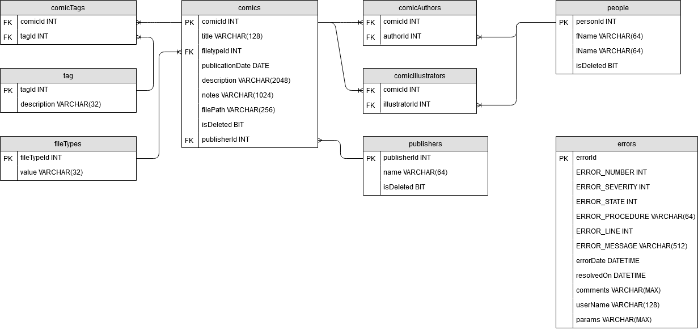

# Comic Book Database

- [Overview](#overview)
- [Entity Relationship Diagram](#erd)
- [License](#license)

## Overview
This is the repository for the development of a comic book database project in .

## Media

## Stored Procedures
- spAddUpdateDeleteTag
	*  Adds/Updates/Deletes a tag to/from the database.

- spAddUpdateDeleteTag
	* Adds/Updates/Deletes a file type to/from the database.

- spAddUpdateDeleteTag
	* Adds/Updates/Deletes a publisher to/from the database.

## License

